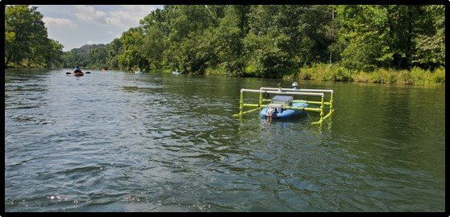
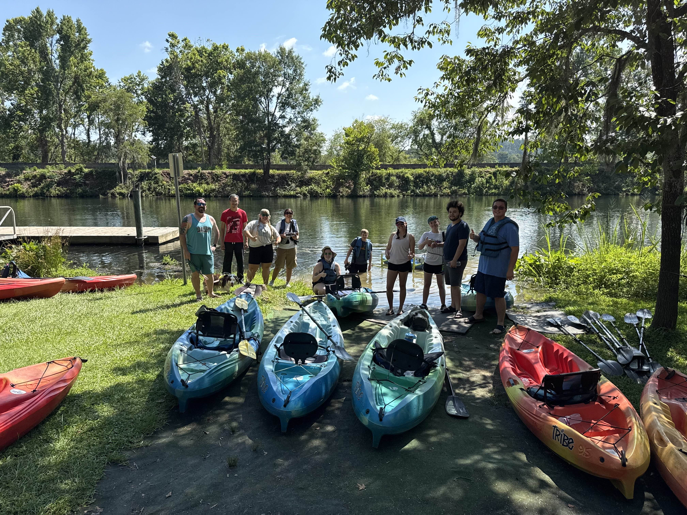
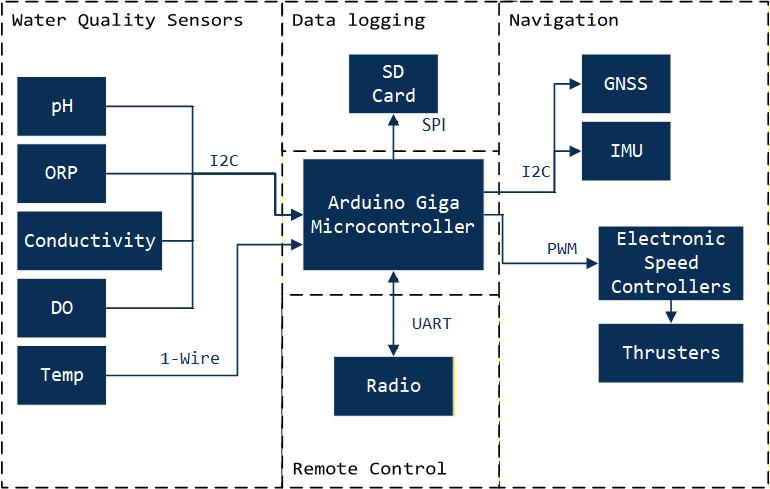

# LearningWIL

Water is Life, aka WIL, is an Autonomous Surface Vehicle developed for Augusta Utilities as part of an internship collaboration with Augusta University. 
The purpose of this repository is to document the required programming and electronics knowledge needed to continue developing WIL.

The "beginner example" directory is a great place to start. I recommend constructing the circuits and typing the code from scratch. Not copy pasting it. These examples are supposed to get you comfortable with building circuits and programming in C++. After working through the begineering examples, you should feel comfortable with how these sensors operate. Take time to tinker with them. For example, see how the latitude and longitude change when you move vs when the gps just sits in a location. With the inertial mesuarement unit, move the sensor arround and see how it works. Plot some data as you move it! (The Serial plotter is really useful here!). Once you have the SD card working, see if you can put everything together to make a GPS data/heading logger!  

The "class based examples" are a little more intricitate programming wise. We use what is called "object oriented programming". When you see a line of code such as " File myFile = ....;" This is saying create a File 'object'. The File object should contain code related to working with Files in memory. An object can have both "methods/functions" and variable associated with them. It's a good way for programmers to keep code contained and find where something is not working. 

The "WILDev" directory contains the combination of all the previous examples into code that lives on both WIL and a remote control. The most recent class based version is in the "new code" directory, but and older version that doesn't use classes is also in the "old code" directory. 
WIL is generally based on this class diagram: 
:TODO: Update Class Diagram. 

