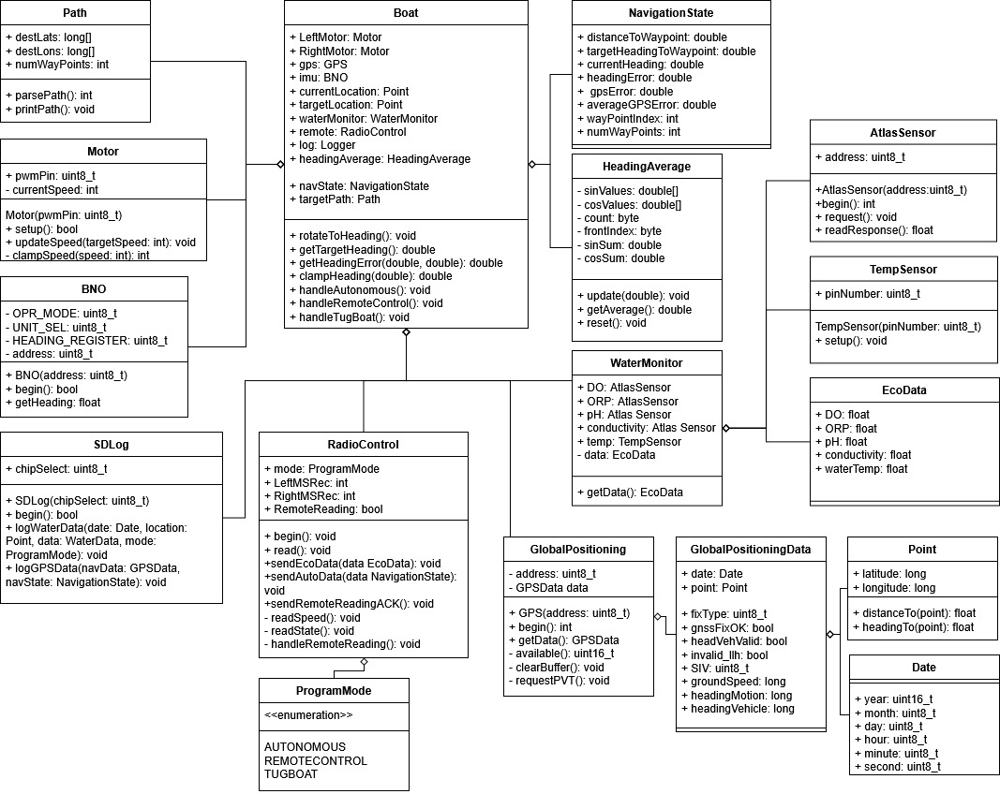

# LearningWIL

**Water Is Life (WIL)** is an Autonomous Surface Vehicle (ASV) developed for Augusta Utilities as part of an internship collaboration with Augusta University.

This repository serves as a learning and continuation guide for future developers. It documents the programming, electronics, and system architecture required to understand and extend WIL.

## Project Overview


WIL is designed for environmental data collection and autonomous navigation of local waterways. Development spans embedded programming, sensor integration, data logging, and vehicle controls.

## Repository Structure

### 1. Beginner Examples
`Beginner Examples/`

This is the recommended starting point for new contributors.

- Build circuits 
- Type the code (do not copy–paste)
- Learn how each sensor works in isolation

Suggested exercises:
- Move the IMU and visualize data using the **Arduino Serial Plotter**
- Observe GPS latitude/longitude changes while stationary vs. moving
- Combine GPS, heading, and SD card logging into a simple data logger!

These examples are for you to better understand each sensor individually before trying to throw all of them together. 
They are the 'building blocks' so to speak of WIL. 


### 2. Class-Based Examples
`Class Based Examples/`

These examples introduce **Object-Oriented Programming (OOP)** in C++.

Example:
```cpp
File myFile = ...
```
This creates a `File` object, which:

- Encapsulates data related to files
- Provides methods (functions) that operate on that data

Using classes helps:

- Organize complex systems
- Isolate bugs
- Scale the codebase as features grow

### 3. Notebooks
`Notebooks/`

This directory contains a digital copy of the lab notebooks for WIL. Not every entry is directly related to WIL. Some were more for my own learning. However, there are tons of several useful entries to help you get more familiar with WIL. In the Beginner Examples, I've linked the related entires on each sensors readme file.

### 4. WIL Development Code

`WILDev/`

This directory contains the arudino code running on:

- WIL (Arduino Giga)
- The remote controller (MKR 1310)

Subdirectories:

- `new code/` – current class-based implementation
- `old code/` – old version (no classes)

New development should be based on `new code/`.

## System Architecture

WIL is generally structured around the following diagrams.

 **:TODO:** Update class diagram to reflect latest architecture.

### Class Diagram



### Block Diagram


## Contributing

This repository is designed to be learned from, modified, and extended. Developers are encouraged to:

- Experiment
- Break things
- Document findings
- Improve clarity for the next developer

Water is life (and so is maintainable code).
